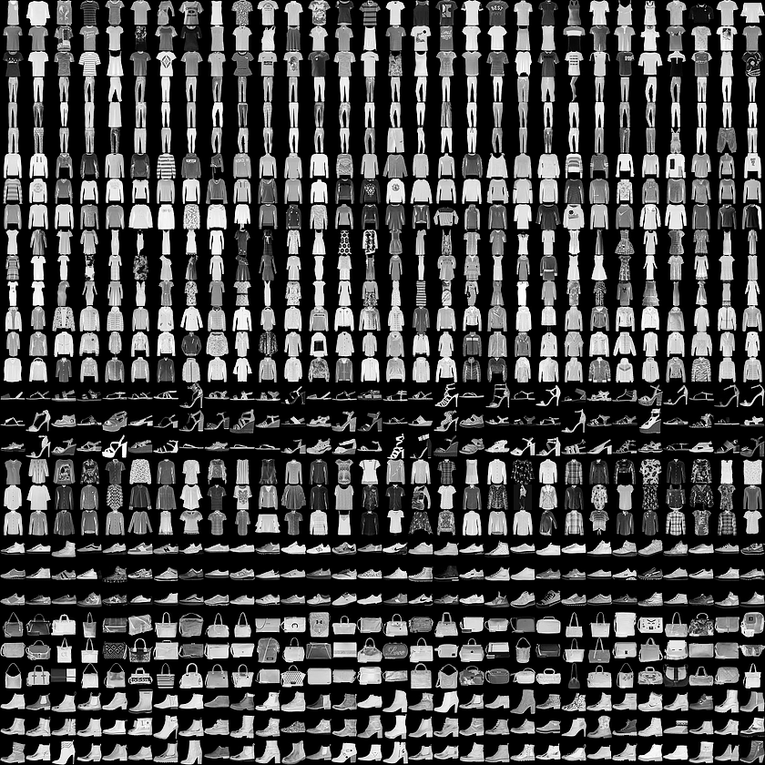

### ___Project idea inspired from `Samson Zhang`@[YouTube](https://www.youtube.com/watch?v=w8yWXqWQYmU)___
-------------
      

-------------

_If interested in the implementation details, please download the markdown source and experiment locally on your machine, because GitHub renders Markdown mathmode and some parts of vanilla Markdown horrendously._


___Implementation is quite different from the one in [his Kaggle Notebook](https://www.kaggle.com/code/wwsalmon/simple-mnist-nn-from-scratch-numpy-no-tf-keras/notebook) that:___

--------------
- This implementation uses `Numba` to speed up the computations (I doubt this actually boosted the performance)
- Uses OOP to modularize code.
- Uses the real `MNIST` Idx data sets, instead of Kaggle provided `csv`s.
- Includes classes for handling `Idx1`, `Idx3` IO.
- class `<<NNetworkMinimal>>` enables saving model states and restoring the trained state from serialized models.


### ___Conceptual framework of the `NNetworkMinimal` training process:___
---------------------

```math
I_{784 \times N} \Longrightarrow H_{10 \times N} \Longrightarrow O_{10 \times N}
\underbrace{I}_{784 \times N} = |pixels~in~image| \times |images|
```
                
### ___Forward propagation___
---------------------
```math
\underbrace{H}_{10 \times N} = \underbrace{W}_{784 \times 10} \cdot \underbrace{I}_{784 \times N} + \underbrace{B}_{10 \times 1}

\underbrace{\hat{H}}_{10 \times N} = \underbrace{f_{activation}(H)}_{10 \times N}

\underbrace{\hat{H}}_{10 \times N} = \underbrace{ReLU(H)}_{10 \times N}

ReLU(x): ~ x ~ if ~ (x > 0) ~ else ~ 0

\underbrace{O}_{10 \times N} = \underbrace{w}_{10 \times 10} \cdot \underbrace{\hat{H}}_{10 \times N} + \underbrace{b}_{10 \times 1}

\underbrace{\hat{O}}_{10 \times N} = \underbrace{f_{softmax}(O)}_{10 \times N}

softmax = \frac{e^O}{\sum_{j = 1}^{K} {e_{j}}^O}

softmax(\underbrace{\begin{bmatrix}
0.9 \\
1.7 \\
8.4 \\
\vdots \\
2.1 \\
8.5 \\
9.1 \\
\end{bmatrix}}_{10 \times 1}) = 
\underbrace{\begin{bmatrix}
0.10 \\
0.23 \\
0.00 \\
\vdots \\
0.74 \\
0.01 \\
0.01 \\
\end{bmatrix}}_{10 \times 1}

```

### ___Backward propagation___
---------------

## $prediction = \underbrace{\begin{bmatrix}
0.01 \\
0.05 \\
0.69 \\
\vdots \\
0.00 \\
0.10 \\
0.07 \\
\end{bmatrix}}_{10 \times 1}
$

## $\text{one hot encoded label} = \underbrace{\begin{bmatrix}
0 \\
0 \\
1 \\
\vdots \\
0 \\
0 \\
0 \\
\end{bmatrix}}_{10 \times 1}$

# $\underbrace{\mathrm{d}O}_{10 \times N} = \underbrace{\hat{O}}_{10 \times N} - \underbrace{L_{True}}_{10 \times N}$

## $\mathrm{d}O_i = \begin{bmatrix}
0.01 \\
0.05 \\
0.69 \\
\vdots \\
0.00 \\
0.10 \\
0.07 \\
\end{bmatrix} - \begin{bmatrix}
0 \\
0 \\
1 \\
\vdots \\
0 \\
0 \\
0 \\
\end{bmatrix}$

## $\underbrace{\mathrm{d}{w}}_{10 \times 10} = \frac{  \overbrace{\mathrm{d}{O}}^{10 \times N} \cdot   \overbrace{\hat{H}^T}^{N \times 10}}{N}$

## $\underbrace{\mathrm{d}{b}}_{10 \times 1} =  \frac{\sum_{i~=~1}^{N}{\overbrace{\mathrm{d}{O_i}}^{10 \times 1}}}{N}$

## $\underbrace{\mathrm{d}{H}}_{10 \times N} = \underbrace{w^T}_{10 \times 10} \cdot \underbrace{\mathrm{d}{O}}_{10 \times N} \times \underbrace{f^{\prime}(H)}_{10 \times N}$

## $\underbrace{\mathrm{d}{W}}_{10 \times 784} = \frac{\overbrace{\mathrm{d}{H}}^{10 \times N} \cdot \overbrace{I^T}^{N \times 784}}{N}$

## $\underbrace{\mathrm{d}{B}}_{10 \times 1} = \frac{\sum_{i~=~1}^{N}{\overbrace{\mathrm{d}{H_i}}^{10 \times 1}}}{N}$

<br>

### ___Paramater updates___
---------------------
## $W = W - \alpha \cdot \mathrm{d}{W}$
## $B = B - \alpha \cdot \mathrm{d}{B}$
## $w = w - \alpha \cdot \mathrm{d}{w}$
## $b = b - \alpha \cdot \mathrm{d}{b}$

__$\alpha$ is the learning rate! (A user specified constant)__

<br>

___After 5,000 iterations, the accuracy scores for `MNIST` datasets were:___

-------------
- `Training dataset` - 0.935367 (93.54%)
- `Test dataset` - 0.928800 (92.88%)

# ___Fashion MNIST___
---------------



Implementation of class `<<NNetworkExtended>>` is fundamentally same as class `<<NNetworkMinimal>>` except for the fact it allows customization of hidden layer attributes (number of hidden layers, number of nodes in layers). See the source for more information.